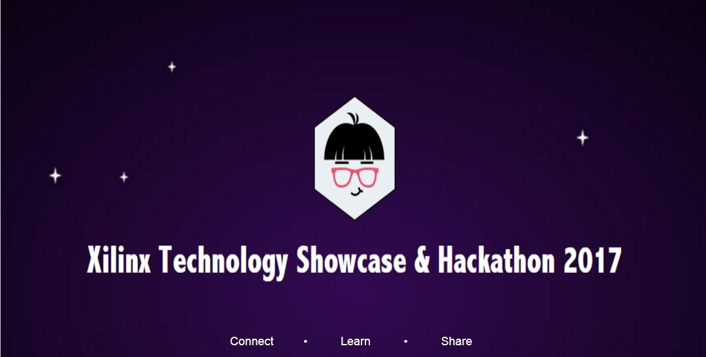

# PYNQ Hackathon 2017

The Xilinx Hackathon is a 30 hour marathon event where you get to create 
custom hardware with simple software scripts. We provide a PYNQ-Z1 board and 
an assortment of Arduino®-compatible shields and sensors. PYNQ is an 
open-source project from Xilinx that makes it easy to design embedded systems 
with Xilinx Zynq All Programmable Systems on Chips. Teams of up to 4 people 
create something new and wonderful.

More information can be found at .

This event is full, registration is now closed.

## Imagine

You’re a creator. You’ve got a notebook full of ideas. Now you have a complete 
Python development environment, software hardware, peripherals, dropped in 
your lap. The possibilities are endless.

## Build

Unplug from the rest of the world for 30 hours and just build. Your team 
will receive technical support, provisions, and lots of space to spread out.

## Share

Present your creation to our panel of judges. Prizes will be awarded. Most 
importantly, your work will be seen by leaders from across the technology 
spectrum: academics, startups, industry leaders. A true once-in-a-lifetime 
opportunity!
