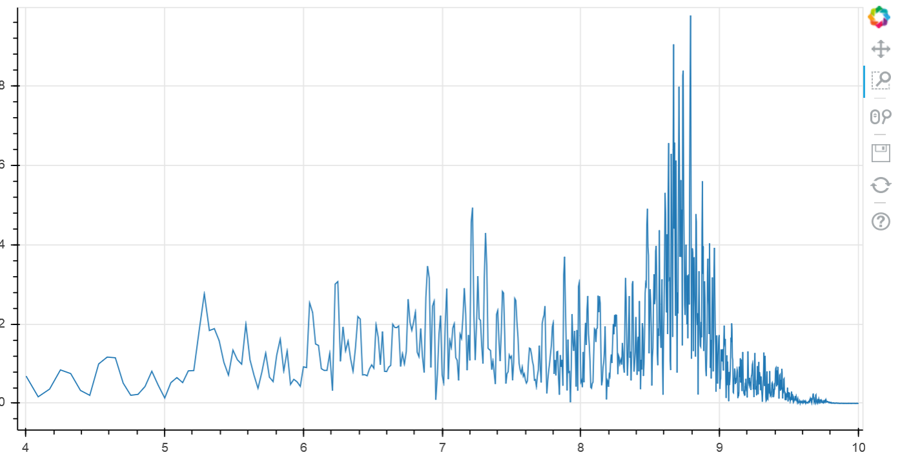

Audio Spectrum Analyzer
=======================

Spectrum analyzer that uses the PYNQ onboard mic 

Getting Started
---------------

ssh into the PYNQ and do the following from the terminal

1. Install Bokeh with: _sudo pip3.6 install bokeh_
2. Start Bokeh server in the background with: _bokeh serve_

You should now be able to run the AudioSpectrumAnalyzer notebook and watch the results of the spectrum analyzer.

This is what you should see if MGMTs Time to Pretend is being played close by

