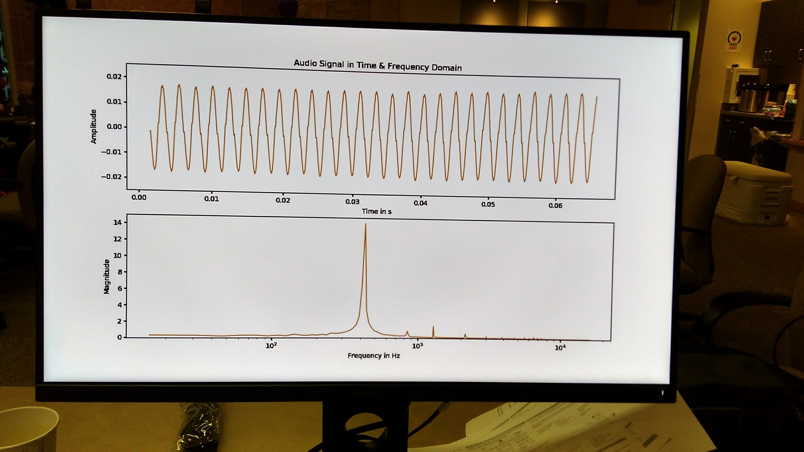

Audio Time & Freq Display
=========================
Author: Todd Franks

Time & Frequency display that uses the PYNQ onboard mic and HDMI out to a monitor 

Getting Started
---------------

1. Connect a monitor to HDMI out
2. Run the the Audio_Display notebook
3. Use a tone generator from a smartphone and hold over microphone to test
4. Press PYNQ PB0 to end and close HDMI display

