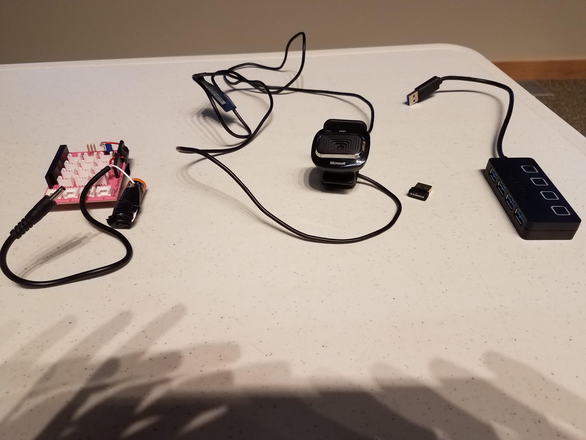
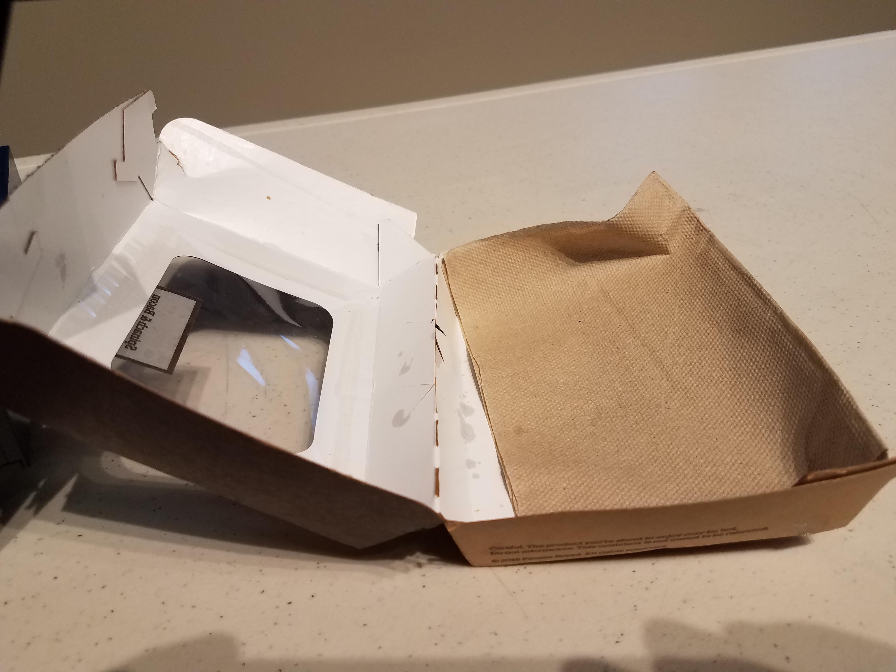
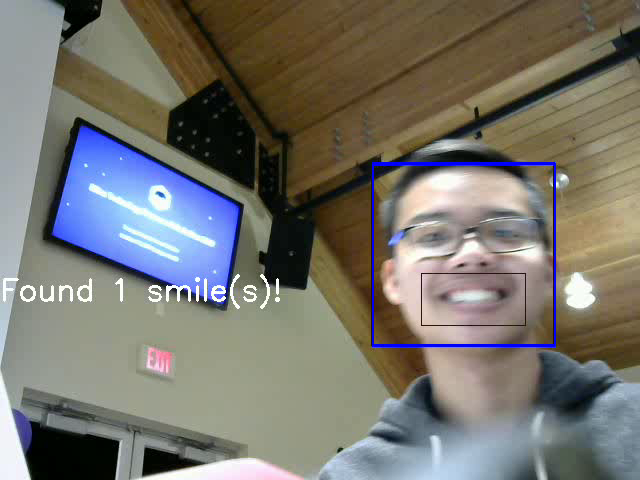

<p align = "center">
    
</p>

# SnapBack the smart hat!

People with short memory retention problems (for example Alzheimer's disease) sometimes cannot recall certain happy moments. Snapback is an IoT project built in 24 hours at the Xilinx Technology Showcase & Hackathon 2017 that constantly analyzes the wearer's surrounding environment and automatically snaps 15 seconds of happy moments when it detects smiling faces. The wearer can later access those videos and their happy moments will never fade!

### We won 2nd place “Runner Up” prize at Xilinx Hackathon 2017!

### Contributors: 
Nhan Tran, Huan Wang, Tyler Quast, William Brickner

### Requirements
see requirements.txt
* Xilinx PYNQ Z1 board
* Python 3
* OpenCV 3.0
* Flask
* Dropbox


### Building and Running
* Set up PYNQ-Z1
```
http://pynq.readthedocs.io/en/latest/getting_started.html
```
* Instal necessary libraries in requirements.txt
If you don't have pip3 installed, run this command:
```
sudo apt-get install python3-pip ffmpeg x264 libx264-dev
```

```
pip3 install -r requirements.txt
```

### How it works
Webcam-equipped cap that captures happy moments by recognizing smiling faces and using that recognition to trigger the capture of a short video clip, which is then wirelessly uploaded to the cloud for later viewing.


### Hardware Setup
Our hardware has been designed to be portable to accomodate for the active lifestyle of our memory makers. To make this possible we made some hardware modifications to accomadate for a chordless device.

### Battery Pack
For power on the go, a power block was repurposed to connect the board to a 9V power source. In this case the power source is three 9V batteries connected in parralel with electrical tape.


### Peripherals
The peripherals that were used were from left to right: Arduino Shield - For powering the periferals USB Webcam - For capturing memories USB Wifi - A Wifi Adapter for uploading memories to the cloud. USB Splitter - A Device for allowing multiple inputs into the board.




### Arduino Shield
The ardunio shield was modified to provide power to the peripherals by soldering the usb splitter power wire to the 5V pin on the board.


### Protective Case
This protective case hold the components together in a compact and discrete manner while you walk around with the snapback.



#### Everything is in the case! Completely cordless! You can walk around and snapback will capture your happy moments!


### Website Server Set up
* 1. Install all the dependencies (see requirements.txt)
```
pip install dropbox
pip install flask
```
* 2. cd into the Webserver folder
```
export the path for flask
export FLASK_APP=main.py
```
* 3. Run:
```
flask run
```
to start the server. Go to localhost:5000 to view the site.


### Run the SnapBack vision program:
```
python3.6 smile_detector.py
```



